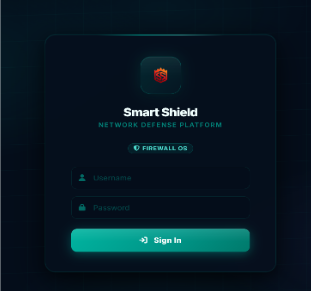
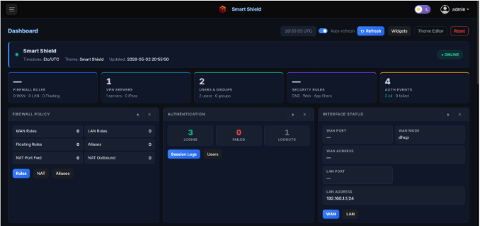
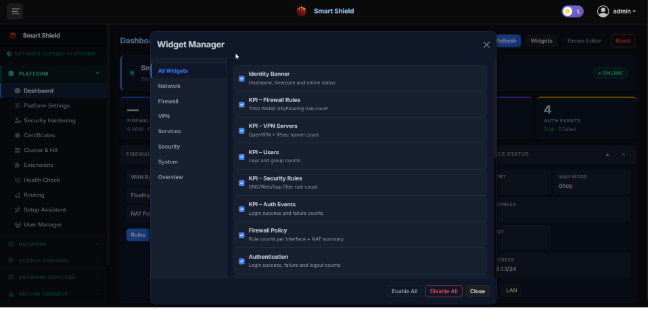
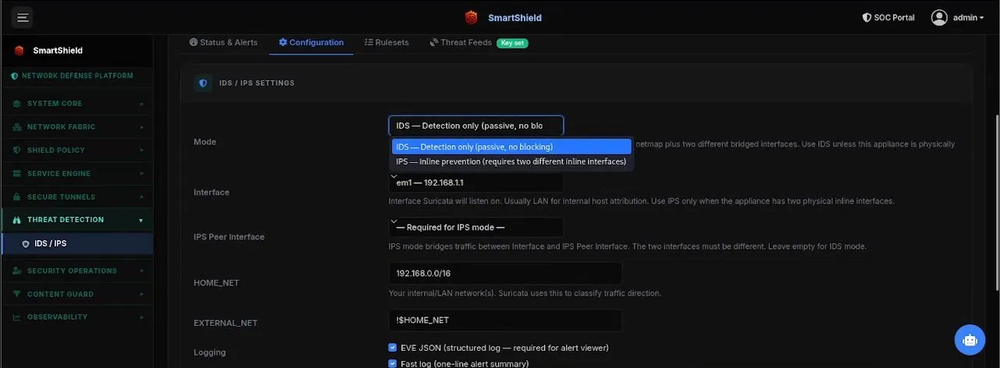
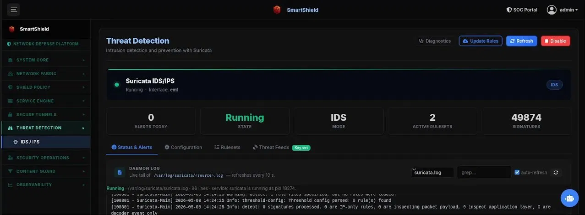
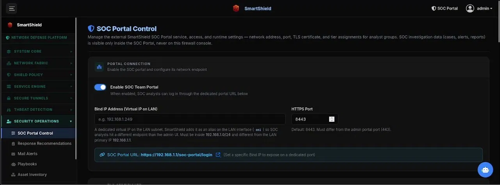
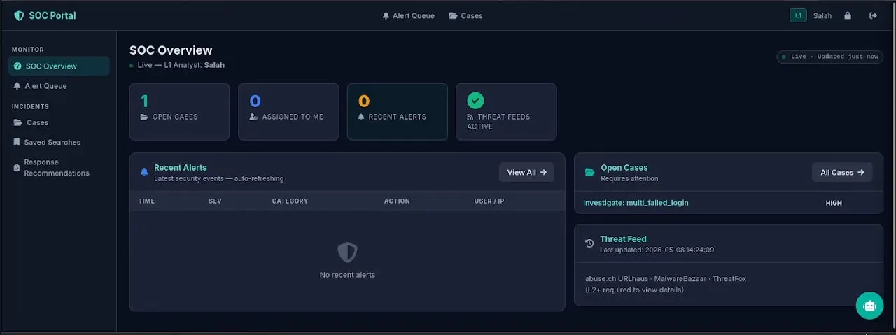

# Summary

Smart-Shield is a research prototype of an open-source, hardware-independent network security platform built on FreeBSD and administered through a web browser. In one system it combines three roles that traditionally require separate products: a stateful firewall appliance, a full-featured network router, and an integrated Security Operations Center (SOC) portal. It bundles intrusion detection and prevention (IDS/IPS), a built-in SIEM with seven log collectors, automated abuse.ch threat-intelligence feeds, VPN management (OpenVPN, IPsec/IKEv2, L2TP), DNSSEC-validating DNS, content filtering, a captive portal, high-availability failover, encrypted backup and rollback, role-based access control, and an AI assistant that answers security questions in plain English [@freebsd2024; @groq2024].

# Statement of Need

Effective network security operations require a layered stack — firewalling, intrusion detection, log aggregation and correlation, threat intelligence, encrypted remote access, and team-based incident response — typically delivered by separate commercial products at significant cost [@lamdakkar2024; @patel2024]. For small enterprises, university research networks, and independent security researchers, assembling and operating such a stack is prohibitively expensive and demands dedicated specialist staff.

Open-source alternatives like pfSense and OPNsense address firewalling and VPN but provide no integrated SIEM, automated threat-intelligence ingestion, SOC team workflows, or AI-assisted administration. Research on intelligent and adaptive security systems [@ahmadi2025; @haydari2023; @apruzzese2018] demonstrates the value of these capabilities but has not produced openly deployable, unified implementations with usable management interfaces. Smart-Shield fills this gap as a freely deployable, fully open-source platform that serves both as a network gateway and as a research and education testbed for network administrators, security researchers, system integrators, and students who need comprehensive, integrated security without licensing costs.

# State of the field

The most widely deployed open-source firewall distributions — **pfSense** and its fork **OPNsense** — offer capable packet filtering, NAT, and VPN, but are packaged as closed, self-contained operating systems that are hard to extend with custom application logic, external AI services, or integrated SOC workflows; studies confirm they present usability and integration barriers in resource-constrained environments [@lamdakkar2024]. Research on intelligent and adaptive security has proposed machine-learning-driven rule generation [@haydari2023], reinforcement learning for dynamic policy optimization [@ahmadi2025], machine-learning-based intrusion detection [@apruzzese2018], deep-learning anomaly detection [@almuhanna2025], NLP-based malware detection in firewalls [@moila2026], and ML-based firewall log classification [@faker2023], and has demonstrated real VPN vulnerabilities such as traffic fingerprinting [@xue2024] — but it has not produced publicly deployable systems with usable management interfaces. Smart-Shield's contribution is a unified, extensible, hardware-independent platform that integrates these capabilities into a single deployable system with a clean, modifiable Python backend, full documentation, and a suite of more than 1,300 tests.

# Software Design and Functionality

Smart-Shield is a Flask web application (Python 3, Gunicorn, Nginx reverse proxy) backed by a SQLite database. All configuration is persisted in the database and applied to the OS through a transaction pipeline of more than 15 configuration writers that generate and atomically apply daemon configuration files, with syntax validation and automatic rollback to a known-good state on failure. The platform exposes roughly 700 routes across 23 blueprints, with an installer script, CLI control tool, and recovery console.

## Firewall, Routing, and High Availability

The firewall manages FreeBSD's PF packet filter through 43 endpoints — floating, WAN, and LAN rule sets, policy-based routing, anti-spoof and bogon blocking, and PF anchors. Every change is validated with `pfctl -nf` before applying, with automatic restore of a `.known_good` backup on failure. NAT covers port forwarding, 1:1 binat, outbound masquerade, IPv6 NPt, and reflection; traffic shaping uses ALTQ disciplines (HFSC, CBQ, PRIQ, FAIRQ) and dummynet limiters. The platform manages VLANs, bridges, LAGG, GRE/GIF tunnels, and PPPoE, with tiered gateway failover, ECMP load balancing, an ICMP health monitor, and CARP/pfsync high availability.

## Threat Detection: IDS/IPS, SIEM, and Threat Intelligence

Smart-Shield integrates Suricata [@suricata2024] in passive IDS mode (BPF capture) or inline IPS mode (netmap), with YAML generated programmatically and validated via `suricata -T`; rules come from the Emerging Threats feed through suricata-update. A built-in SIEM runs seven concurrent collectors — IDS alerts, DHCP leases, DNS queries, PF states, authentication logs, system messages, and pattern-based anomaly detection for brute-force and IDS-flood patterns — all using persistent file-offset tracking to avoid duplicate ingestion across restarts. Threat intelligence is ingested every four hours from three abuse.ch feeds (URLhaus, MalwareBazaar, ThreatFox); newly identified malicious IPs are pushed atomically into a live PF table, blocking them without administrator intervention.

## VPN, DNS, and Network Services

The VPN module manages OpenVPN (multi-instance, TUN/TAP, AES-256-GCM), IPsec/IKEv2 via strongSwan, and L2TP/IPsec via mpd5, with a wizard that automates certificate-authority creation and certificate signing; all keys and secrets are encrypted at rest. The DNS module provides an Unbound recursive resolver with DNSSEC, DNS-over-TLS, per-subnet ACLs, overrides, and query logging, alongside ISC DHCPd and Kea DHCPv6. Content filtering operates at the DNS, URL, and application layers with cross-layer conflict detection. An integrated certificate authority handles signing, revocation, ACME issuance, and OCSP stapling; a captive portal adds voucher-based authenticated access; and additional services include Dynamic DNS, NTP, SNMP, UPnP, and traffic graphs.

## Security, SOC Collaboration, and AI Assistant

The platform implements session-based authentication with signed cookies, PBKDF2 hashing, per-IP and per-username brute-force lockout, CSRF protection, scoped API keys, and a complete NDJSON audit log of every state-changing action. Role-based access control supports multi-user deployments with page-level permissions. The integrated SOC module provides a separate login realm in which L1–L3 analysts triage IDS and SIEM alerts, assign incidents, and log response actions. The AI assistant, built on the Groq API (llama-3.3-70b-versatile) [@groq2024], answers natural-language questions using more than 12 read-only tools over live system state; write actions such as blocking a domain or adding a firewall rule require explicit two-stage user confirmation, so no change occurs without human approval.

# Testing and Validation

Smart-Shield includes a test suite of more than 1,300 unit, integration, and acceptance tests run in isolated virtual networks. In benchmarks the firewall added under 0.2 milliseconds of latency for LAN-to-LAN traffic and under 0.6 milliseconds for LAN-to-WAN forwarded traffic, VPN tunnels stayed under 4 milliseconds round-trip, the dashboard responded in under 300 milliseconds, and a 200-rule set applied in under 2 seconds. The system ran continuously for 48 hours without service failures and handled 50 VPN configurations without degradation. The full suite is included in the repository and is executable by reviewers locally.

# Research impact statement

Smart-Shield lowers the barrier to empirical network-security research by exposing every subsystem — PF firewalling, Suricata IDS/IPS, SIEM collectors, automated threat-intelligence feeds, VPN, and an LLM assistant — through a single documented Python backend. Existing open-source platforms such as pfSense and OPNsense address firewalling and VPN but provide no integrated SIEM, threat-intelligence ingestion, or AI-assisted administration [@lamdakkar2024], leaving researchers without a unified, openly deployable testbed.

Smart-Shield fills this gap by enabling controlled, reproducible experiments on firewall-policy effectiveness, VPN fingerprinting, anomaly detection, and AI-assisted threat response — research directions identified as valuable but previously lacking deployable implementations [@ahmadi2025; @haydari2023; @apruzzese2018]. The platform has been validated through internal deployment by the development team across a suite of more than 1,300 unit, integration, and acceptance tests in isolated virtual networks, confirming end-to-end functionality. Its documented Python backend and open Apache 2.0 license lower the barrier to extension, replication, and adoption by the broader research and education community.

# AI usage disclosure

Generative AI tools (large language models) were used during this project both to assist in drafting and editing this manuscript and as a coding aid during software development. All AI-assisted output — including text, source code, and reference metadata — was reviewed, tested, and verified by the authors, who take full responsibility for the final manuscript and software. The AI assistant integrated into Smart-Shield is a separate runtime feature of the software, described above, and is unrelated to the preparation of this work.

# Availability

The Smart-Shield source code is available on GitHub at [https://github.com/Mohamed-Salah11/Smart-Shield](https://github.com/Mohamed-Salah11/Smart-Shield) and is released under the Apache License 2.0. A software archive with a permanent DOI is available on Zenodo at [https://doi.org/10.5281/zenodo.20474266](https://doi.org/10.5281/zenodo.20474266).

# Acknowledgements

The authors thank the faculty and staff of The Higher Canadian Institute for Engineering Technology and Business for the academic environment and resources that supported this work.

# References
